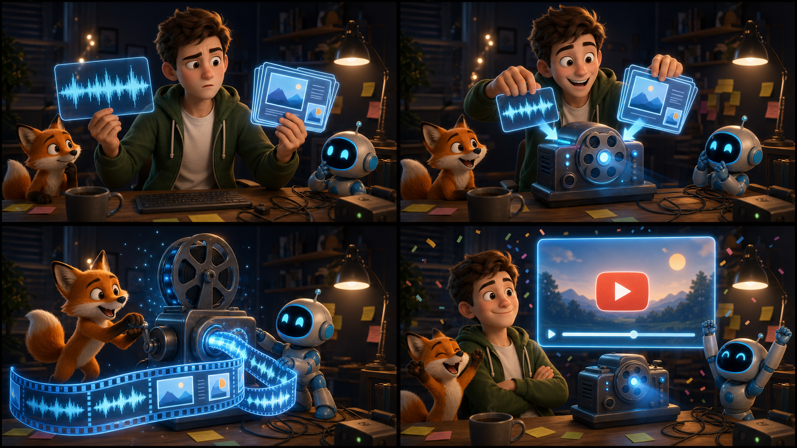

# Video Maker

Automated pipeline for generating YouTube videos from audio narration and PDF slide decks. Produces MP4 video with synchronized slides, SRT subtitles, YouTube metadata, and thumbnails.

<p align="center">
  
</p>

## 🏭 The Content Factory

video-maker is **stage 2** of an automated pipeline that turns a **blog article
into a published YouTube video** — no API keys, driven end-to-end through
logged-in browser sessions (Camoufox) and local media tooling.

| # | Stage | Repo | What it does |
|---|-------|------|--------------|
| 1 | Generate | [gaia](https://github.com/suenot/gaia) | Drive NotebookLM / Gemini / Flow from a logged-in session → audio overview + slide deck |
| **2** | **Build** | **[video-maker](https://github.com/suenot/video-maker)** ⬅ *this repo* | Audio narration + slide-deck PDF → synced MP4 (+ SRT, thumbnail) |
| 3 | Describe | [video-metadata](https://github.com/suenot/video-metadata) | Video + article → YouTube title / description / tags / chapter timestamps |
| 4 | Publish | [video-publisher](https://github.com/suenot/video-publisher) | Drive YouTube Studio → upload with metadata, channel switch, visibility |

**Flow:** `article → gaia → video-maker → video-metadata → video-publisher → YouTube`
(the published video is then embedded back into the blog article).

## What It Does

Given an audio file (narration) and a PDF slide deck, the pipeline:

1. **Converts PDF to images** — each slide becomes a PNG via `pdftoppm` (Poppler)
2. **Extracts text from slides** — OCR via Tesseract to get slide content
3. **Transcribes audio** — speech-to-text via OpenAI Whisper with word-level timestamps
4. **Generates SRT subtitles** — Whisper segments converted to YouTube-ready SRT format
5. **Synchronizes slides with audio** — matches transcription text to slide OCR text using word overlap + bigram scoring to determine when each slide should appear
6. **Generates video** — assembles slides + audio into MP4 using FFmpeg with hardware-accelerated encoding (HEVC/H.264 via VideoToolbox on macOS)
7. **Researches YouTube tags** — combines YouTube Suggest API, competitor title analysis (via yt-dlp), and intent-based phrases
8. **Generates metadata** — title, description with timestamps, tags, category, problems (for YouTube Education)
9. **Generates thumbnail** — 1280×720 PNG from the first slide

## Requirements

- Python 3.9+
- [FFmpeg](https://ffmpeg.org/) with VideoToolbox support (default on macOS)
- [Poppler](https://poppler.freedesktop.org/) (`pdftoppm` command) — `brew install poppler`
- [Tesseract OCR](https://github.com/tesseract-ocr/tesseract) — `brew install tesseract`
- [yt-dlp](https://github.com/yt-dlp/yt-dlp) (optional, for tag research)

### Python Dependencies

```bash
python -m venv venv
source venv/bin/activate
pip install openai-whisper pillow pytesseract
```

Optional (for tag research via Google Trends):
```bash
pip install pytrends
```

## Project Structure

```
video_maker/
├── .claude/skills/
│   └── youtube-video-publishing.md  # Agent skill: full publishing workflow
├── scripts/
│   ├── run_pipeline.sh          # Main pipeline runner
│   ├── pdf_to_images.py         # PDF → PNG slide images
│   ├── extract_pdf_text.py      # OCR text extraction from slide images
│   ├── extract_subtitles.py     # Audio → Whisper JSON transcription
│   ├── subtitles_to_srt.py      # Whisper JSON → SRT subtitles
│   ├── sync_slides.py           # Build slide-to-time mapping
│   ├── generate_video.py        # Slides + audio → MP4
│   ├── make_short.py            # Landscape video + SRT → 1080×1920 Short
│   ├── ingest_youtube.py        # Third-party YouTube video → NotebookLM source.md
│   ├── research_youtube_tags.py # YouTube tag research
│   ├── generate_metadata.py     # Generate YouTube metadata
│   └── generate_thumbnail.py    # Generate 1280×720 thumbnail
├── input/                       # Source files (audio, PDF slides)
├── output/                      # Final video, metadata, subtitles, thumbnail
├── temp/                        # Intermediate files (slide images, OCR, timeline)
├── ingest/                      # Downloaded third-party videos (git-ignored)
└── venv/                        # Python virtual environment
```

## Usage

### Run Full Pipeline

```bash
bash scripts/run_pipeline.sh en   # English version
bash scripts/run_pipeline.sh ru   # Russian version
```

### Run Individual Steps

Each script can be run independently:

```bash
# 1. Convert PDF to images
python scripts/pdf_to_images.py --pdf input/slides.pdf --out-dir temp/slides --dpi 200

# 2. Extract text from slide images (OCR)
python scripts/extract_pdf_text.py --images-dir temp/slides --output temp/slides_text.json --lang eng

# 3. Transcribe audio with Whisper
python scripts/extract_subtitles.py --audio input/audio.m4a --output temp/subtitles.json --model base --language en

# 4. Convert subtitles to SRT
python scripts/subtitles_to_srt.py --subtitles temp/subtitles.json --output output/video.srt

# 5. Sync slides with audio timeline
python scripts/sync_slides.py --subtitles temp/subtitles.json --slides-text temp/slides_text.json --output temp/timeline.json

# 6. Generate video
python scripts/generate_video.py --timeline temp/timeline.json --slides-dir temp/slides --audio input/audio.m4a --output output/video.mp4

# 7. Research YouTube tags
python scripts/research_youtube_tags.py --seed-keywords "keyword1,keyword2" --lang en --max-tags 15 --output temp/tags.json

# 8. Generate metadata
python scripts/generate_metadata.py --subtitles temp/subtitles.json --slides-text temp/slides_text.json --timeline temp/timeline.json --output-json output/metadata.json --output-txt output/metadata.txt --lang en --tags-file temp/tags.json

# 9. Generate thumbnail
python scripts/generate_thumbnail.py --slides-dir temp/slides --output output/thumbnail.png
```

## Video Encoding

The pipeline supports three codecs:

| Codec | Speed | File Size | Notes |
|---|---|---|---|
| `hevc_videotoolbox` | Fast (GPU) | Smallest | Default. Apple Silicon HEVC hardware encoding |
| `h264_videotoolbox` | Fastest (GPU) | Medium | Apple Silicon H.264 hardware encoding |
| `libx264` | Slow (CPU) | Small | Best compression, but may OOM on large slides |

Default: `hevc_videotoolbox` at 1920×1080 resolution, 1 fps (optimal for static slide content).

## Vertical Shorts

NotebookLM's "Short Video Overview" renders **Latin script only** — fed Russian or
Chinese sources it returns English on-screen headings and burned-in subtitles that are
empty tofu squares. So Shorts for `@marketmaker-school-ru` and `@marketmaker-zh` are cut
locally instead: `scripts/make_short.py` takes an already-finished landscape video plus
its SRT and produces a 1080×1920 Short with correctly rendered Cyrillic / CJK subtitles.

```bash
python scripts/make_short.py \
    --video output/<slug>/<slug>_ru.mp4 \
    --srt   output/<slug>/<slug>_ru.srt \
    --start 1:00 --end 1:52 \
    --lang ru \
    --title "Почему маркет-мейкер теряет деньги" \
    --out output/<slug>/<slug>_ru_short.mp4
```

| Flag | Description |
|---|---|
| `--video`, `--srt` | Finished 16:9 mp4 and its SRT |
| `--start`, `--end` | Segment to cut, `SS.s` or `MM:SS`; `--end` defaults to the end of the source |
| `--lang` | `ru` \| `zh` \| `en` — selects the font and the line-breaking rules |
| `--title` | Optional hook line pinned at the top for the whole Short |
| `--font`, `--font-index` | Override the font file / the face inside a `.ttc` |
| `--sub-size`, `--title-size` | Type sizes in px (72 / 82) |
| `--sub-fps` | Frame rate of the subtitle PNG sequence (10) |
| `--codec` | `libx264` (default) or `h264_videotoolbox` |
| `--keep-temp` | Keep the rendered subtitle PNGs for inspection |

**Framing.** The source is scaled to 1080 wide and centred vertically; the empty top and
bottom are filled with a blurred, darkened, zoomed copy of the same frame
(`split` → `scale`+`crop`+`boxblur` → `overlay`), so there are no black bars.

**Subtitles.** The local FFmpeg is built without libass and freetype, so the `subtitles`,
`ass` and `drawtext` filters do not exist — `ffmpeg -filters | grep -E "subtitles|drawtext|ass"`
comes back empty. The subtitle track is therefore rasterised with Pillow into a transparent
PNG sequence (10 fps; identical layers are hard-linked, so a 50 s Short needs ~25 unique
PNGs) and composited as a second input with `overlay`.

**Fonts.** Arial Black for `ru`/`en`, Hiragino Sans GB W6 for `zh`. Every character in the
cues and the title is compared against the font's notdef glyph before anything is rendered;
if a glyph would come out as a tofu box the script aborts and names the offending
characters rather than shipping broken text.

**Typography.** White text with a dark stroke over a semi-transparent rounded box, in the
bottom third. Cyrillic and Latin wrap per word, CJK per character (never breaking before
closing punctuation). Cues that need more than 3 lines shrink down to 46 px instead of
covering the slide.

**Output.** H.264 High / yuv420p, 30 fps, AAC 192 kb/s, `+faststart`. Segments longer than
180 s print a warning — that is YouTube's ceiling for Shorts.

## Ingesting a Source Video

Topic ideas come from two monitored channels. When one is worth covering, the
video is mined for **research input only** — it is never re-uploaded, re-cut or
translated, and the article and video we ship are written from scratch.
`scripts/ingest_youtube.py` collapses the download, the transcript and the deck
extraction into one command and writes a single markdown file to hand to
NotebookLM.

```bash
python scripts/ingest_youtube.py 22iy2mDFiF8 --out-dir ingest
```

Produces `ingest/<video_id>/source.md` — front matter, then the transcript
interleaved with the slides at their timestamps — plus the slide PNGs in
`ingest/<video_id>/slides/`.

| Flag | Description |
|---|---|
| `video` | Video id or any YouTube URL (positional) |
| `--out-dir` | Where to put `<video_id>/` (`ingest`) |
| `--scene-threshold` | ffmpeg scene score that marks a new slide (0.25) |
| `--dedup-threshold` | Mean pixel difference below which two frames are the same slide (4.0) |
| `--sample-fps` | Sampling rate used when the deck has no detectable scene cuts (0.5) |
| `--keep-video` | Keep the source mp4; it is deleted by default |
| `--whisper-model` | Model for the no-captions fallback (`large-v3-turbo`) |
| `--ocr-lang` | Tesseract language (`eng`) |

**Transcript.** YouTube's own captions are preferred — free and instant. They
arrive as scrolling cues where every cue repeats the tail of the previous one
and paints the new words in with inline `<00:00:01.234><c>` timing tags, so a
naive dump duplicates every line. The tags are stripped and any line already
seen in the last few lines is dropped; on the test video 529 cues collapse to
265 unique lines with no repeats left. The result is regrouped into ~30 s
paragraphs. Whisper runs only when the video has no captions at all, and then at
`large-v3-turbo` — `base` mangles product names and numbers.

**Slides.** These channels render static decks, so a scene-change filter should
recover them. In practice their decks are near-black: ffmpeg's `scene` score is
an absolute difference, so two completely unrelated dark slides score about
0.02 and the usual 0.25 threshold returns *one* frame for a ten-minute deck.
When the filter comes back that empty the script says so and samples at
`--sample-fps` instead. Either way the candidates are then grouped
perceptually — each frame compared against the first frame of the open group on
a 64×36 grayscale copy with the bottom 8% cropped off, so a talking-head corner
or a creeping progress bar never opens a new slide. One frame per group is kept,
the middle one, which is past the transition-in and shows the settled slide. The
test video goes 293 candidate frames → 47 slides.

**Slide text.** Tesseract OCRs each surviving slide and the text lands in
`source.md` in a fenced block under the image, so NotebookLM reads the deck as
text. If `tesseract` is not installed the script warns and lists the slides with
their timestamps for reading by hand rather than pulling in a heavy dependency.

## Slide Synchronization Algorithm

The `sync_slides.py` uses a greedy forward-matching algorithm:
- Slides advance monotonically (never go back)
- Each transcription segment is scored against the current slide and `look_ahead` upcoming slides
- A slide transition occurs only when the next slide's score exceeds the current by `advance_ratio` (default 1.3×) **and** the current slide has been shown for at least `min_duration` seconds (default 5s)
- Scoring uses word overlap + bigram matching between transcription text and OCR slide text

## Input File Structure

```
input/<slug>/
├── audio_en.m4a      # English narration
├── audio_ru.m4a      # Russian narration (optional)
├── slides_en.pdf     # English slide deck
├── slides_ru.pdf     # Russian slide deck (optional)
└── article_ru.md     # Article with YAML frontmatter (optional)
```

## Output Files

| File | Description |
|---|---|
| `<slug>.mp4` | Final video (slides + audio) |
| `<slug>.srt` | YouTube-ready SRT subtitles |
| `<slug>_metadata.json` | Structured metadata (title, description, tags, timestamps) |
| `<slug>_metadata.txt` | Human-readable metadata for YouTube Studio |
| `<slug>_thumbnail.png` | 1280×720 thumbnail image |

## Agent Skill (.claude/skills)

The `.claude/skills/youtube-video-publishing.md` file is a key part of this project. It's an agent skill definition for [Claude Code](https://docs.anthropic.com/en/docs/claude-code) that teaches the AI assistant the complete YouTube video publishing workflow:

- **Title rules** — keyword placement, length limits, no clickbait
- **Description template** — SEO hook, timestamps, article link, Telegram CTA, tags
- **Tag pipeline** — how to research and filter thematic YouTube tags
- **YouTube Education fields** — Category, Type, Level, Problems generation
- **Slide title extraction rules** — OCR filtering, fragment detection, line merging
- **Video encoding rules** — codec selection, resolution, framerate rationale
- **Pipeline integration** — how all scripts connect

When you open this project in Claude Code, the agent automatically picks up the skill and can run the full pipeline, generate metadata, fix encoding issues, etc. — with full context about the project's conventions and quality rules.

## Related Projects

- [gaia](https://github.com/suenot/gaia) — generates the audio + slides this pipeline consumes
- [video-metadata](https://github.com/suenot/video-metadata) — YouTube title/description/tags/timestamps (pre-publish)
- [video-publisher](https://github.com/suenot/video-publisher) — uploads the finished video to YouTube

## License

MIT
