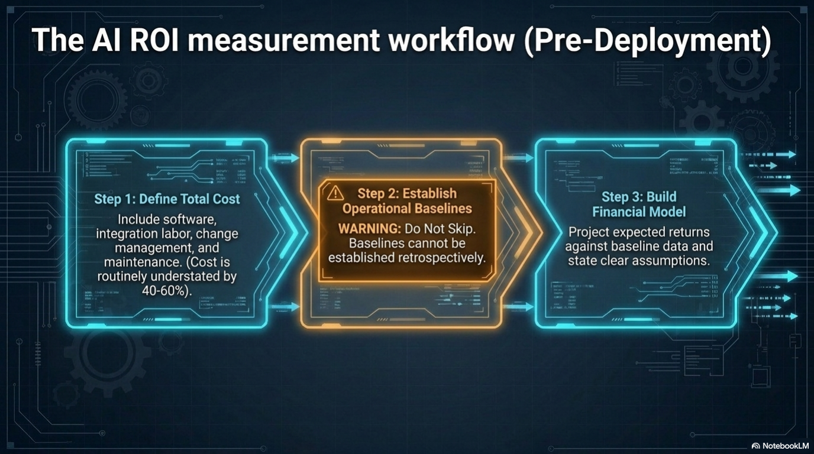
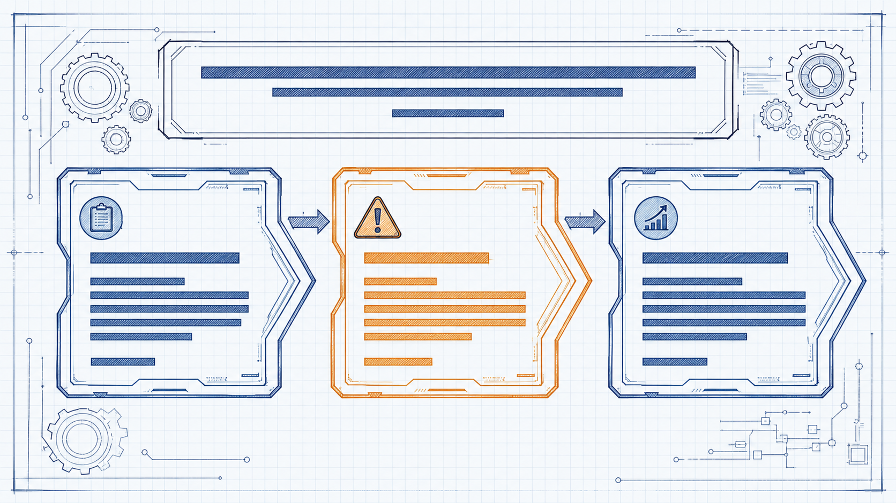
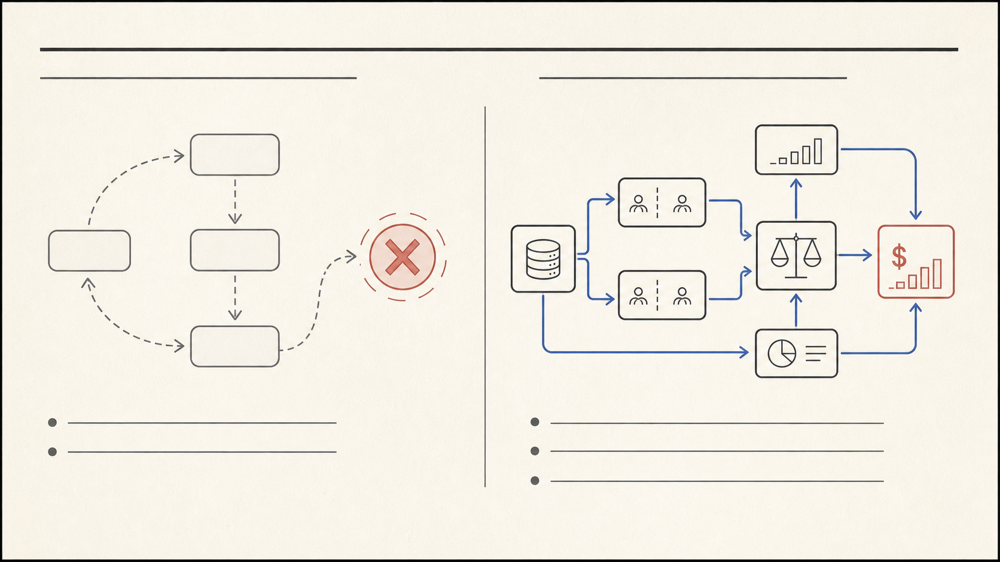
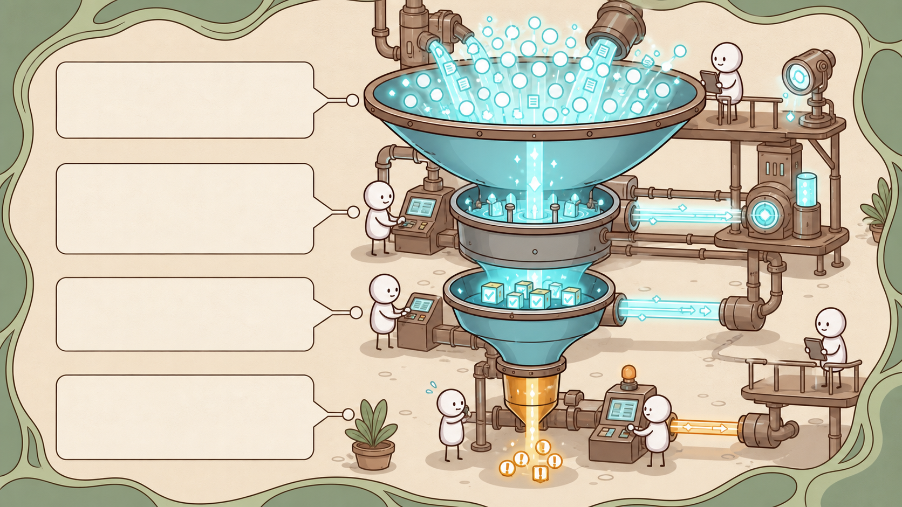

# Варианты визуального стиля: Self-Learning Company

Это сравнение не меняет сценарий и факты из `motion-storyboard.md`. Меняется только подача объяснения. Текст, цифры и точные подписи диаграмм по-прежнему накладываются отдельным детерминированным слоем, а не генерируются внутри изображения.

[Общий лист сравнения](style-variants-overview.png)

## 1. Dark technical HUD — исходный NotebookLM

Темный графитовый фон, cyan-свечения, янтарные предупреждения, панели интерфейса. Это текущий стиль PDF.

- Лучше всего: когда нужна непрерывная визуальная совместимость с уже готовыми NotebookLM-слайдами.
- Движение: появление панелей, проходящие импульсы по линиям, построение графиков, мягкий camera push-in.
- Риск: при 20-минутной длине однообразные HUD-рамки могут утомлять; стиль хорошо работает, если в каждом кадре двигается именно диаграмма, а не весь экран.

## 2. Blueprint engineering — стиль референсов Yersham

Белая чертежная сетка, черные и синие линии, кораллово-янтарный акцент для предупреждений. Взяты принципы из `youtube_styles`: инженерная иллюстрация, видимые стрелки, большие чистые поля и графическая иерархия.

- Лучше всего: слайды 03–11, где объясняется причинность, workflow и архитектура.
- Движение: линии дорисовываются, карточки собираются из контуров, стрелки проводят взгляд по шагам, warning появляется штампом.
- Эффект: самый понятный и убедительный вариант для технической аудитории; я бы выбрал его кандидатом на основной стиль всего ролика.

## 3. Editorial systems map — стиль референсов Yersham

Теплая бумага, много воздуха, точные тонкие схемы, синий для доказуемой связи и красный для ошибки или неверного вывода.

- Лучше всего: слайды 02–05, 11–12 и 15: бизнес-тезис, атрибуция, сравнение подходов, ROI, финальный вывод.
- Движение: диаграмма рисуется как схема в заметках исследователя; левая и правая части сравнения появляются по очереди; bullet-пункты входят только после того, как зритель увидел причинную связь.
- Эффект: наиболее зрелая, спокойная и "редакционная" подача. Хорошо подходит для англоязычного B2B-ролика.

## 4. Warm comic explainer — стиль SystemOfHabits

Теплая кремовая палитра, простые персонажи, машина как метафора процесса, cyan-поток для автоматизации и янтарный для исключений. Основан на примерах из `youtube_styles/systemofhabits123`.

- Лучше всего: слайды 05–07, 10, 13–14, где процесс можно показать как фабрику, систему или маленькую историю.
- Движение: данные физически текут по трубе, персонажи наблюдают или выполняют один понятный жест, exception уходит в отдельный янтарный канал.
- Эффект: самый доступный и запоминающийся стиль, но он снижает строгость финансовой части. Его стоит использовать либо для всего ролика с более широкой аудиторией, либо как осознанные вставки для кейсов, а не вперемешку с 15 разными стилями.

## Рекомендация по выбору

Для одного цельного видео я бы рассматривал два полных направления:

1. **Blueprint engineering** — технически убедительный, легче всего анимировать без потери точности, подходит всей структуре видео.
2. **Editorial systems map** — спокойнее, дороже по ощущению и сильнее для executive/B2B-истории.

Comic лучше оставить отдельным направлением для более массовой версии или для коротких кейсов. Dark HUD можно оставить, если важнее всего совместимость с исходным NotebookLM, но он наименее отличает новый ролик от старой слайдовой версии.

## Что останется неизменным после выбора

- 15 блоков из [motion storyboard](motion-storyboard.md);
- исходная логика схем, метрик и тезисов;
- точные английские подписи из исходного PDF;
- схема переходов и тайминг, синхронизированный с NotebookLM-аудио.

После выбора стиля нужно сделать один полный образцовый слайд: рекомендую Slide 03 для editorial или Slide 08 для blueprint. Он станет шаблоном для нарезки, upscale, motion-слоев и будущих Seedance-вставок.
